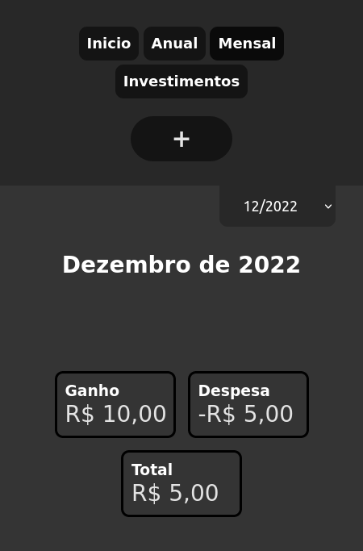
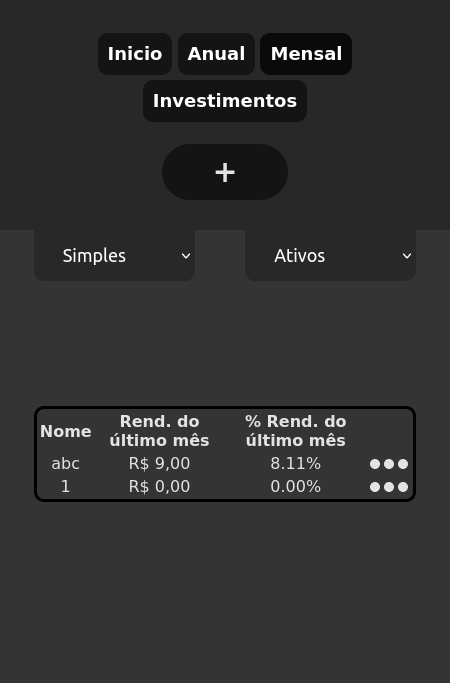

# my-money
Meu gerenciador financeiro pessoal - My personal financial manager

[clique aqui para ir para o site](https://lucasregisdemoraes.github.io/my-money)

## Descrição
Site para gerenciamento financeiro, onde é mostrado onde o dinheiro esta guardado, despositado ou investido.

O site usa o localStorage para armazenar os dados inseridos, sendo possivel fazer o backup desses dados.

Possui as funções de adicionar, remover ou editar transações e investimentos e seus progressos, onde é possivel acompanhar os valores por tabelas e cartões.

## Tecnologias e conceitos usados

- HTML 
- CSS
- JavaScript
- Manipulação de DOM
- Código comentado
- LocalStorage
- Upload e download de backup em arquivo de formato .txt 

## Páginas

### Homepage

### Mensal

### Investimentos

---

## Melhorias que podem ser incorporadas
- Criar página para o histórico de todas movimentações
- Criar a página anual
- Adicionar a validação do arquivo de upload
- Adicionar animação para quando os valores forem alterados
- Passar o index da transação para o botão editar e remover
- Remover o parametro(objeto parameters) de funções que só usam um parametro
- Usar throw new Error nas funções de validação
- Se não houver nenhuma transação ou investimento mostrar nas páginas essa informação
- Alterar o título da página mensal para "MyMoney - Mensal"
- No modal de investimentos mostrar o total disponivel que pode ser investido
- No modal de transferência, fazer com que quando selecionar o local de onde fazer a transferência desativar o local correspondente de para onde fazer a transferência
- Transformar todos os valores dos inputs type number em números antes de submeter o formulário para não ter o problema de colocar um + ou - no input
- Quando o valor da transação é menor que o disponível alertar o usuário
- Mudar nome da função cleanFields para clearFields no arquivo mensal.js
- Adicionar função clearFields para cada formulário
- Adicionar uma tag form no modal de confirmação
- Remover div vazia do header da homepage
- Fechar os summarys quando fechar o modal
- Fazer com que o campo data ja esteja preenchido quando abrir o modal
- Ordenar lista de meses
- Ordenar transações e investimentos na ordem de data decrescente
- Melhorar o design das tabelas
- Usar reduce para fazer calculos em arrays
- Deixar de passar o evento do submit do form para a validateFields function e usar o event.preventDefault() no onsubmit
- Atualizar a função validateFields para receber os campos para serem validados como parametro

## Bugs para ser resolvidos

### Funcionais
- Ao apertar o botão fechar de um modal fechar somente o modal aberto
- Ao alterar o valor dos inputs do modal de nova transação na página inicial alterar o valor total
- Permitir adicionar ou editar um investimento na página de investimentos somente se tiver dinheiro suficiente na conta
- Ao validar os campos não permitir que o valor seja um espaço vazio
- Na função para atualizar o valor total da transação, mudar de "onkeyup" para quando o valor ser alterado, porque quando o valor é alterado de outra forma não atualiza o valor

### Design
- Modais
- Inputs dos modais
- Input do upload do backup
- Modal de transferência
